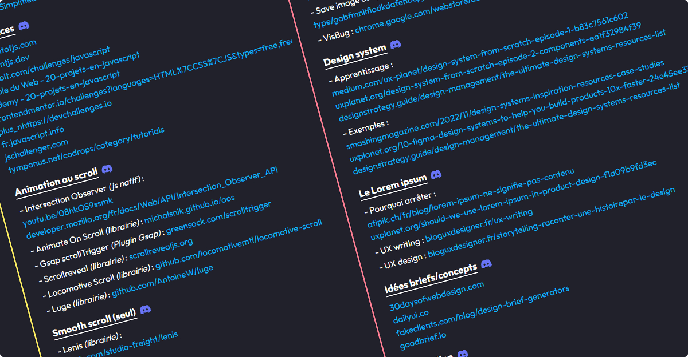

# [Liens utiles](https://aelweak.github.io/liens-utiles/)

Cette liste n'a pas **du tout** pour vocation d'être LA plus complète.

C'est sans prétention et avec plaisir que je partage quelques ressources issues de :

-   Mes "favoris internet", que j'eus utilisés (pour de la découverte/apprentissage notamment), que j'utilise (à titre professionnel ou personnel, régulièrement), ou que je compte utiliser prochainement (et qui peuvent donc disparaître parce que "finalement pas vraiment utiles").
-   Ma veille continue
-   Ou de partages directs : `Issues`, MP/DM, etc...

... Si cela peut en aider certains, ça me va déjà très bien 🙂.

Il se peut que vous ne retrouviez pas forcément ce que vous utilisez, vous, habituellement, et surtout... pas forcément (beaucoup) de ressources... en français !

Non pas qu'elles n'existent pas mais, cette liste étant principalement partagée sur le serveur Discord ["Le Repaire du Web", d'Enzo Ustariz](https://discord.com/invite/XFP75gW), par respect pour son travail de formateur, je ne souhaite pas proposer de liens de "concurrents directs" ou de contenu(s) fortement "similaire(s)" (et français donc).  
_(Toutefois, cela ne signifie pas que ces mêmes contenus ne sont pas de qualité et/ou que je n'en consulte pas "en parallèle".)_

# Proposer des liens

Avec plaisir ! C'est par ici : [proposer un lien](https://github.com/Aelweak/liens-utiles/issues) 🙏.

Néanmoins, gardez à l'esprit que je ne mettrais pas de ressources qui feraient "doublon" avec celles déjà présentes (surtout si "plus intéressantes/utiles") ou si celles-ci concernent des technos/langages que je ne souhaite pas forcément aborder à titre pro ou perso.

J'essaie de remercier les contributeurs, au mieux, avec une très modeste visibilité dans la section `Merci à`, ci-dessous, et une mention dans les messages des commits (qui apparaissent également dans les _"Notes de mise à jour"_ de la page/liste).

# Fonctionnalités à venir

La liste est déjà un peu longue mais des améliorations "d'UX" (tris, filtres, structure, etc...) sont prévues, pour rendre le tout plus "pratique".  
(Quand ? _"Soon:tm:"_ 🙄)

# Merci à :

<table>
<td align="center">

<a href="https://github.com/Sakoutecher" target="_blank"><b>Sakoutecher</b></a> (1 Lien)

</td>
<td align="center">

<a href="https://github.com/Vavart" target="_blank"><b>Vavart</b></a> (1 Lien)

</td>
</table>

### Mot de la fin

N'hésitez pas à venir discuter, ici ou sur Discord, je ne mords pas (tout le temps 🐷😇).
